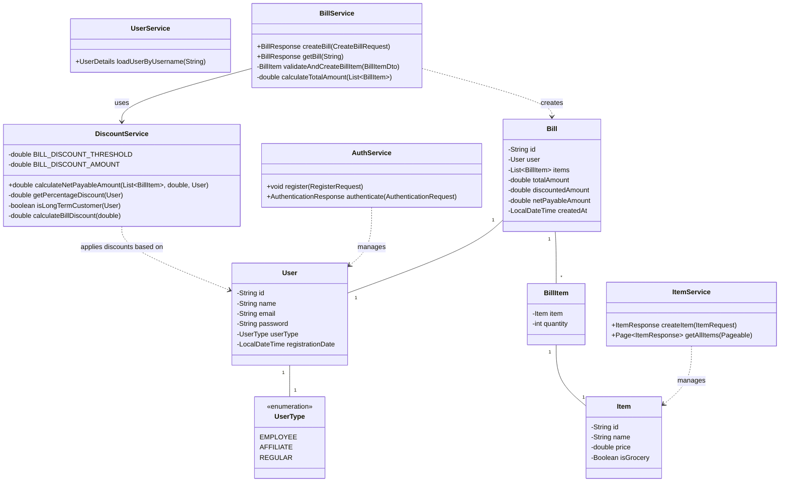

# Retail Store Discount System

A Spring Boot application that provides APIs for a retail store discount system. The system calculates discounts based
on user type, purchase history, and bill amount.

## Table of Contents

- [Features](#features)
- [Technologies Used](#technologies-used)
- [High-Level Design](#high-level-design)
- [Prerequisites](#prerequisites)
- [Getting Started](#getting-started)
- [Running Tests](#running-tests)
- [API Documentation](#api-documentation)
- [Discount Rules](#discount-rules)
- [Security Notes](#security-notes)

## Features

- User management with different user types (Employee, Affiliate, Regular)
- Item management with grocery/non-grocery classification
- Bill creation with automatic discount calculation
- Role-based access control with JWT authentication
- Comprehensive test coverage

## Technologies Used

- Java 17
- Spring Boot 3.4.3
- Spring Security with JWT
- MongoDB
- Maven
- JaCoCo for test coverage
- Docker

## High-Level Design

The application follows a layered architecture with clear separation of concerns:



## Prerequisites

- Java 17+
- Maven 3.6+
- Docker and Docker Compose
- MongoDB (or use the provided Docker Compose configuration)

## Getting Started

### 1. Clone the Repository

```bash
git clone https://github.com/rahafo/retail-store-app
cd retail-discount-system
```

### 2. Start MongoDB

```bash
docker-compose up -d
```

### 3. Build the jar file

```bash
mvn clean package
```

### 4. Build docker image

```bash
docker build -t retail-app .   
```

### 5. Run docker image

```bash
docker run -p 8080:8080 --network retail-store-app_retail-network retail-app
```

The application will be available at `http://localhost:8080`

### 6. Using Postman Collection

A Postman collection is available in the repository root directory. To use it:

1. Import the collection into Postman
2. Run create user and authentication requests first to obtain a token
3. Other requests will automatically use the token from the authentication response

## Running Tests

### Run All Tests

```bash
mvn test
```

### Generate Coverage Reports

```bash
mvn clean test jacoco:report
```

The coverage report will be available at:

```
target/site/jacoco/index.html
```

## API Documentation

### Authentication

- Register a new user:
  ```
  POST /api/v1/auth/register
  ```

- Authenticate and get token:
  ```
  POST /api/v1/auth/authenticate
  ```

### Items Management

- Create a new item (EMPLOYEE role required):
  ```
  POST /api/v1/items
  ```

- Get all items (any authenticated user):
  ```
  GET /api/v1/items
  ```

### Bills Management

- Create a bill:
  ```
  POST /api/v1/bills
  ```

- Get bill by ID (either the bill owner or EMPLOYEE role):
  ```
  GET /api/v1/bills/{id}
  ```

## Discount Rules

The system implements the following discount rules:

1. If the user is an employee of the store, they get a 30% discount.
2. If the user is an affiliate of the store, they get a 10% discount.
3. If the user has been a customer for over 2 years, they get a 5% discount.
4. For every $100 on the bill, there would be a $5 discount (e.g. for $990, you get $45 as a discount).
5. The percentage-based discounts do not apply to groceries.
6. A user can get only one of the percentage-based discounts on a bill.

## Security Notes

* **Credentials Storage**: The database credentials and JWT secret key should be stored in a secure vault or environment
  variables in a production environment. For this assessment and to simplify setup, they're included directly in the
  application.yaml file.

* **JWT Implementation**: In a production environment, tokens should be signed using asymmetric cryptography (
  private/public key pair). For this assessment, we've implemented a simpler approach using symmetric encryption with a
  shared secret key.

* **Security Best Practices**: For a production deployment, consider implementing:
    - Credential rotation
    - Rate limiting
    - HTTPS enforcement
    - More detailed audit logging
    - Token revocation
